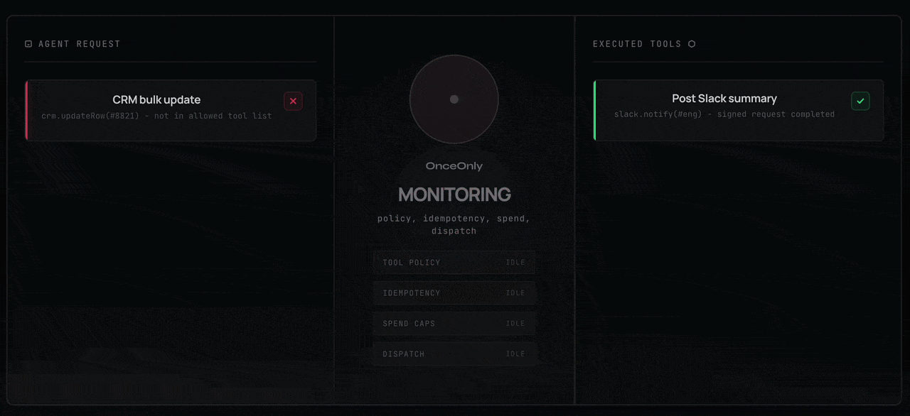

<div align="center">
<h1>OnceOnly TypeScript SDK</h1>

**AI Agent Execution & Governance Layer**

Exactly-once execution + runtime safety + agent control plane.

[](https://www.npmjs.com/package/@onceonly/onceonly-sdk)
[](./LICENSE)
[](https://www.npmjs.com/package/@onceonly/onceonly-sdk)
[](https://nodejs.org/)
[](https://www.typescriptlang.org/)

[Website](https://onceonly.tech/) • [Docs](https://docs.onceonly.tech) • [API Reference](https://docs.onceonly.tech/reference/idempotency/) • [Examples](./examples/)


</div>

## What is OnceOnly?

**The problem:** AI agents are non-deterministic. They retry failed calls, re-run tools, crash mid-execution, and replay events. This causes duplicate payments, repeated emails, and inconsistent state.

**The solution:** OnceOnly sits between your AI and the real world, guaranteeing:

- Exactly-once execution. Same input = same result.
- Crash safety. Worker dies? Resume safely.
- Retry safety. Replays are deduplicated.
- Budget control. Cap spend per agent/hour/day.
- Permission enforcement. Allowlist and blocklist tools.
- Kill switch. Disable rogue agents instantly.
- Forensic audit. Full action history.

This is not just idempotency. This is an AI agent control plane.

---

## Quick Start (30 seconds)

```bash
npm i @onceonly/onceonly-sdk
```

```ts
import { OnceOnly } from "@onceonly/onceonly-sdk";

const client = new OnceOnly({
  apiKey: process.env.ONCEONLY_API_KEY!
});

const result = await client.checkLock({
  key: "webhook:stripe:evt_123",
  ttl: 3600
});

if (result.duplicate) {
  return { status: "already_processed" };
}

// Process webhook exactly once.
```

That is it. Your webhook is now idempotent.

---

## 5-Minute Tutorial

### 1) Basic Deduplication (Webhooks, Cron Jobs, Workers)

```ts
import { OnceOnly } from "@onceonly/onceonly-sdk";

const client = new OnceOnly({ apiKey: process.env.ONCEONLY_API_KEY! });

export async function stripeWebhook(eventId: string) {
  const lock = await client.checkLock({
    key: `stripe:${eventId}`,
    ttl: 7200
  });

  if (lock.duplicate) {
    return { status: "ok" };
  }

  await handlePaymentSucceeded(eventId);
  return { status: "processed" };
}
```

### 2) AI Agent with Budget and Permissions

```ts
import { OnceOnly } from "@onceonly/onceonly-sdk";

const client = new OnceOnly({ apiKey: process.env.ONCEONLY_API_KEY! });

await client.gov.upsertPolicy({
  agent_id: "billing-agent",
  max_actions_per_hour: 200,
  max_spend_usd_per_day: 50,
  allowed_tools: ["stripe.charge", "send_email"],
  blocked_tools: ["delete_user"]
});

const result = await client.ai.runTool({
  agentId: "billing-agent",
  tool: "stripe.charge",
  args: { amount: 9999, currency: "usd" },
  spendUsd: 0.5
});

if (result.allowed) {
  console.log("Charged", result.result);
} else {
  console.log("Blocked", result.policyReason);
}
```

### 3) Exactly-Once Local Function Execution

```ts
import { OnceOnly, idempotentAi } from "@onceonly/onceonly-sdk";

const client = new OnceOnly({ apiKey: process.env.ONCEONLY_API_KEY! });

const sendWelcomeEmail = idempotentAi(
  client,
  async (userId: string) => {
    await emailService.send({
      to: getUserEmail(userId),
      template: "welcome"
    });
    return { sent: true };
  },
  {
    keyFn: (userId) => `welcome:email:${userId}`,
    ttl: 86400
  }
);

await sendWelcomeEmail("user_123");
await sendWelcomeEmail("user_123");
await sendWelcomeEmail("user_123");
```

### 4) Run Timeline Debug (New)

```ts
import { OnceOnly } from "@onceonly/onceonly-sdk";

const client = new OnceOnly({ apiKey: process.env.ONCEONLY_API_KEY! });

const runId = `run_demo_${Math.floor(Date.now() / 1000)}`;
const key = `ai:job:debug:${runId}`;

await client.postEvent({
  runId,
  type: "sdk_debug",
  status: "start",
  message: "run debug demo started from ts sdk"
});

await client.aiRun({ key, runId });

const timeline = await client.getRunTimeline(runId, 200, 0);
console.log(timeline);
```

---

## Cheat-Sheet (Pick the Right Call)

**I want...**

- Idempotent webhook/cron/job: `checkLock({ key, ttl, meta })`
- Long-running server job: `ai.runAndWait({ key, ttl, metadata })`
- Start/attach run without polling: `aiRun({ key, runId })`
- Governed tool call: `ai.runTool({ agentId, tool, args, spendUsd, runId })`
- Local side-effect exactly once: `ai.runFn(key, fn, opts)`
- Add custom run event: `postEvent({ runId, type, ... })`
- Fetch run timeline: `getRunTimeline(runId, limit, offset)`
- Update notification preferences: `updateNotifications({ ... })`
- Decorator version: `idempotent(...)` or `idempotentAi(...)`

**Async alias methods also exist**

- `checkLockAsync`
- `aiRunAsync`
- `aiRunAndWaitAsync`
- `postEventAsync`
- `getRunTimelineAsync`
- `updateNotificationsAsync`

---

## Full LLM Agent Flow (No OnceOnly vs OnceOnly)

### Without OnceOnly (duplicates and money loss)

```ts
// examples/ai/agent_full_flow_no_onceonly.ts
const decision = await llmDecide();
const payload = { tool: decision.tool, args: decision.args };

await callTool(payload);
await callTool(payload); // duplicate charge on retry
```

### With OnceOnly (deduped and governed)

```ts
// examples/ai/agent_full_flow_onceonly.ts
const res = await client.ai.runTool({
  agentId: "billing-agent",
  tool: "stripe.charge",
  args: { amount: 9999, currency: "usd", user_id: "u_42" },
  spendUsd: 0.5
});

if (res.allowed) {
  console.log(res.result);
} else {
  console.log("Blocked", res.policyReason);
}
```

Why this matters:

- Prevents duplicate external side effects on retries.
- Enforces budgets and permissions at runtime.
- Produces auditable decision and execution traces.

---

## 📚 Complete Feature Matrix

| Feature | Description | Typical Use Case |
|---|---|---|
| `checkLock()` | Fast idempotency primitive | Webhooks, cron jobs, workers |
| `ai.runAndWait()` | Server-side long-running jobs | Reports, generation pipelines |
| `ai.runTool()` | Governed tool execution | Agent tool calls with budgets/permissions |
| `ai.runFn()` | Local exactly-once side effects | Email, billing, write operations |
| `idempotent()` / `idempotentAi()` | Decorator API | Simple function-level dedup |
| `gov.upsertPolicy()` | Policy management | Budget caps, tool allow/block |
| `gov.disableAgent()` | Kill switch | Emergency stop |
| `gov.agentLogs()` | Audit trail | Forensics and compliance |
| `postEvent()` + `getRunTimeline()` | Run debugging timeline | Operational debugging and support |

---

## 🧠 Architecture Layers

OnceOnly provides 5 layers of safety:

```
┌─────────────────────────────────────────────────────────┐
│ L5: Agent Governance (policies, kill switch, audit)    │
├─────────────────────────────────────────────────────────┤
│ L4: Decorator Runtime (`idempotentAi`)                        │
├─────────────────────────────────────────────────────────┤
│ L3: Local Side-Effects (`ai.runFn`)                           │
├─────────────────────────────────────────────────────────┤
│ L2: AI Job Orchestration (`ai.runAndWait`)                    │
├─────────────────────────────────────────────────────────┤
│ L1: Idempotency Primitive (`checkLock`)                        │
└─────────────────────────────────────────────────────────┘
```

---

## Run Debugging and Failure Analysis

The TypeScript SDK now supports two debug-first methods:

- `postEvent(...)` -> `POST /v1/events`
- `getRunTimeline(runId, ...)` -> `GET /v1/runs/{run_id}`

### Attach `runId` to `ai.run` / `aiRun`

`runId` is automatically propagated by the SDK:

- Key mode: into `metadata.run_id`
- Tool mode: into `args.run_id`

```ts
await client.ai.run({
  key: "ai:job:report:42",
  runId: "run_report_42"
});

await client.ai.run({
  agentId: "debug-agent",
  tool: "send_email",
  args: { to: "ops@example.com" },
  runId: "run_report_42"
});
```

### Failure Demo (tool not found)

```ts
import { ApiError } from "@onceonly/onceonly-sdk";

try {
  await client.ai.run({
    agentId: "debug-agent",
    tool: "this_tool_must_not_exist",
    runId: "run_fail_demo_123"
  });
} catch (err) {
  if (err instanceof ApiError) {
    console.error(err.statusCode, err.detail);
  }
}

console.log(await client.getRunTimeline("run_fail_demo_123", 200, 0));
```

Look for `tool_result` and `run_finished` events to identify failure reason quickly.

---

## 💎 Golden Example (Payment with Full Safety)

```ts
import { OnceOnly } from "@onceonly/onceonly-sdk";

const client = new OnceOnly({ apiKey: process.env.ONCEONLY_API_KEY! });

async function chargeOrder(orderId: string, userId: string, amountCents: number) {
  const key = `payment:${orderId}:charge`;

  const lock = await client.checkLock({
    key,
    ttl: 3600,
    meta: { orderId, userId, amountCents, source: "checkout" }
  });

  if (lock.duplicate) {
    return { status: "already_processed", key };
  }

  const governed = await client.ai.runTool({
    agentId: "billing-agent",
    tool: "stripe.charge",
    args: { order_id: orderId, user_id: userId, amount: amountCents, currency: "usd" },
    spendUsd: 0.02
  });

  if (!governed.allowed) {
    return { status: "blocked", reason: governed.policyReason };
  }

  return { status: "charged", result: governed.result };
}
```

---

## 🛡️ Governance & Safety

OnceOnly governance controls are available under `client.gov`:

- Policy management: `upsertPolicy`, `policyFromTemplate`, `getPolicy`, `listPolicies`
- Tool controls: `createTool`, `toggleTool`, `deleteTool`, `listTools`
- Agent controls: `disableAgent`, `enableAgent`
- Observability: `agentLogs`, `agentMetrics`

### Agent Policies

```ts
await client.gov.upsertPolicy({
  agent_id: "billing-agent",
  max_actions_per_hour: 200,
  max_spend_usd_per_day: 50,
  allowed_tools: ["stripe.charge", "send_email"],
  blocked_tools: ["delete_user"]
});

await client.gov.disableAgent("billing-agent", "manual safety stop");
await client.gov.enableAgent("billing-agent", "resume operations");
```

### Policy Templates

```ts
const policy = await client.gov.policyFromTemplate(
  "new-agent",
  "moderate", // strict|moderate|permissive|read_only|support_bot
  {
    max_actions_per_hour: 300,
    blocked_tools: ["delete_user"]
  }
);

console.log(policy);
```

### Kill Switch

```ts
await client.gov.disableAgent("rogue-agent", "suspicious behavior detected");
await client.gov.enableAgent("rogue-agent", "re-enabled after investigation");
```

### Audit and Forensics

```ts
const logs = await client.gov.agentLogs("billing-agent", 100);
for (const log of logs) {
  console.log(`${String(log.ts)} ${log.tool} ${log.decision}`);
  console.log(`  reason=${log.policyReason ?? log.reason}`);
  console.log(`  risk=${log.riskLevel} spend=${log.spendUsd}`);
}

const metrics = await client.gov.agentMetrics("billing-agent", "day");
console.log(metrics.totalActions, metrics.blockedActions, metrics.totalSpendUsd, metrics.topTools);
```

---

## 🔌 Framework Integrations

### LangChain-Style Tool Wrapper

```ts
import { OnceOnly } from "@onceonly/onceonly-sdk";

const client = new OnceOnly({ apiKey: process.env.ONCEONLY_API_KEY! });

export async function idempotentSendEmailTool(input: { to: string; subject: string; body: string }) {
  return client.ai.runFn(
    `agent:email:${input.to}:${input.subject}`,
    async () => {
      await emailService.send(input);
      return { sent: true, to: input.to };
    },
    { ttl: 3600, metadata: { tool: "send_email", to: input.to } }
  );
}
```

### Fastify / Express Webhook

```ts
import { OnceOnly } from "@onceonly/onceonly-sdk";

const client = new OnceOnly({ apiKey: process.env.ONCEONLY_API_KEY! });

app.post("/webhooks/stripe", async (req, res) => {
  const event = req.body as { id: string; type?: string };
  const lock = await client.checkLock({
    key: `stripe:${event.id}`,
    ttl: 7200,
    meta: { type: event.type ?? "unknown" }
  });

  if (lock.duplicate) {
    return res.send({ status: "duplicate" });
  }

  await processStripeEvent(event);
  return res.send({ status: "processed" });
});
```

Integration examples in this repo:

- [Tool wrapper with stable keying](./examples/ai/langchain_tool_ai_lease.ts)
- [Webhook dedup](./examples/general/webhook_dedup.ts)

---

## 📖 API Reference

### Core Client

```ts
import { OnceOnly } from "@onceonly/onceonly-sdk";

const client = new OnceOnly({
  apiKey: process.env.ONCEONLY_API_KEY!,
  baseUrl: "https://api.onceonly.tech/v1", // optional
  timeoutMs: 5000,                          // HTTP timeout
  failOpen: true,                           // graceful degradation for checkLock
  maxRetries429: 3,                         // auto-retry on 429/5xx/network
  retryBackoffSec: 0.5,                     // initial backoff (seconds)
  retryMaxBackoffSec: 10.0                  // max backoff (seconds)
});
```

### API Endpoints Map (Public)

- Core: `GET /v1/me`, `POST /v1/me/notifications`, `GET /v1/usage`, `GET /v1/usage/all`, `GET /v1/events`, `GET /v1/metrics`, `POST /v1/events`, `GET /v1/runs/{run_id}`
- Idempotency: `POST /v1/check-lock`
- AI Jobs: `POST /v1/ai/run`, `GET /v1/ai/status`, `GET /v1/ai/result`
- AI Lease (local side-effects): `POST /v1/ai/lease`, `POST /v1/ai/extend`, `POST /v1/ai/complete`, `POST /v1/ai/fail`, `POST /v1/ai/cancel`
- Governance (policies): `POST /v1/policies/{agent_id}`, `POST /v1/policies/{agent_id}/from-template`, `GET /v1/policies`, `GET /v1/policies/{agent_id}`
- Governance (agents): `POST /v1/agents/{agent_id}/disable`, `POST /v1/agents/{agent_id}/enable`, `GET /v1/agents/{agent_id}/logs`, `GET /v1/agents/{agent_id}/metrics`
- Tools Registry: `POST /v1/tools`, `GET /v1/tools`, `GET /v1/tools/{tool}`, `POST /v1/tools/{tool}/toggle`, `DELETE /v1/tools/{tool}`

### Notification Preferences

```ts
const prefs = await client.updateNotifications({
  emailNotificationsEnabled: true,
  toolErrorNotificationsEnabled: true,
  runFailureNotificationsEnabled: false
});
console.log(prefs);
```

### Idempotency

```ts
const result = await client.checkLock({
  key: "order:12345",
  ttl: 3600,
  meta: { user_id: 42 }
});

if (result.duplicate) {
  console.log("Duplicate", result.firstSeenAt);
} else {
  console.log("First time - proceed");
}
```

### AI Execution

```ts
// Long-running server job
const job = await client.ai.runAndWait({
  key: "report:monthly:2026-04",
  ttl: 1800,
  timeout: 120,
  pollMin: 1,
  pollMax: 10,
  metadata: { month: "2026-04" },
  runId: "run_report_2026_04"
});
console.log(job);

// Governed tool runner
const toolRes = await client.ai.runTool({
  agentId: "billing-agent",
  tool: "stripe.charge",
  args: { amount: 9999, currency: "usd" },
  runId: "run_charge_001",
  spendUsd: 0.5
});
if (toolRes.allowed) console.log(toolRes.result);
else console.log("Blocked:", toolRes.policyReason);

// Local function execution
const fnRes = await client.ai.runFn(
  "email:welcome:user123",
  async () => sendEmail(),
  {
    ttl: 300,
    waitOnConflict: true,
    timeout: 60,
    errorCode: "email_failed"
  }
);
console.log(fnRes);

// Run debug APIs
await client.postEvent({ runId: "run_report_2026_04", type: "note", message: "manual investigation marker" });
console.log(await client.getRunTimeline("run_report_2026_04", 200, 0));
```

### AI Namespace (`client.ai`)

- `run({ key, ttl, metadata, runId })`
- `run({ agentId, tool, args, spendUsd, runId })`
- `status(key)`, `result(key)`, `wait(key, opts)`, `runAndWait(opts)`
- `runTool({ agentId, tool, args, spendUsd, runId })`
- `runFn(key, fn, opts)`
- Low-level lease lifecycle: `lease`, `extend`, `complete`, `fail`, `cancel`

### AI Modes (Choose One)

| Mode | Use When | Call | Result Type |
|---|---|---|---|
| Job (server-side) | Long-running tasks | `ai.runAndWait({ key: ... })` | `AiResult` |
| Tool (governed) | Agent tool execution | `ai.runTool({ agentId, tool, ... })` | `AiToolResult` |
| Local side-effects | Your code does the work | `ai.runFn(key, fn, ...)` | `AiResult` |

### AI Result Shapes (AI-friendly)

```ts
type AiToolResult = {
  ok: boolean;
  allowed: boolean;
  decision: string; // "executed" | "blocked" | "dedup"
  policyReason?: string;
  riskLevel?: string;
  result?: Record<string, unknown>;
};

type AiResult = {
  ok: boolean;
  status: string; // "completed" | "failed" | "in_progress"
  key: string;
  result?: Record<string, unknown>;
  errorCode?: string;
  doneAt?: string;
};
```

### Tool Result: Happy vs Blocked

```ts
const res = await client.ai.runTool({
  agentId: "billing-agent",
  tool: "stripe.refund",
  args: { charge_id: "ch_123", amount: 500 },
  spendUsd: 0.2
});

if (res.allowed) {
  console.log("OK", res.result);
} else {
  console.log("BLOCKED", res.policyReason);
}
```

### Decorators

```ts
import { idempotent, idempotentAi } from "@onceonly/onceonly-sdk";

const safePayment = idempotent(client, async (orderId: string) => {
  await charge(orderId);
  return { ok: true };
}, { keyPrefix: "payment", ttl: 3600 });

const onboardUser = idempotentAi(client, async (userId: string) => {
  await createAccount(userId);
  await sendWelcome(userId);
  return { onboarded: true };
}, {
  keyFn: (userId) => `onboard:${userId}`,
  ttl: 600,
  metadataFn: (userId) => ({ userId })
});
```

### Governance Namespace (`client.gov`)

- Policies: `upsertPolicy`, `policyFromTemplate`, `getPolicy`, `listPolicies`
- Tools registry: `createTool`, `listTools`, `getTool`, `toggleTool`, `deleteTool`
- Agent controls: `disableAgent`, `enableAgent`
- Observability: `agentLogs`, `agentMetrics`

---

## Tools Registry (User-Owned Tools)

```ts
const tool = await client.gov.createTool({
  name: "send_email",
  url: "https://example.com/tools/send_email",
  scope_id: "global",
  auth: { type: "hmac_sha256", secret: "shared_secret" },
  timeout_ms: 15000,
  max_retries: 2,
  enabled: true
});

await client.gov.toggleTool("send_email", false, "global");
console.log(tool);
```

Tools registry limits by plan:

- Free: 1 tool
- Starter: 20 tools
- Pro: 100 tools
- Agency: 1000 tools

Rules and expectations:

- `name` must be unique per `scope_id` and match `^[a-zA-Z0-9_.:-]+$`
- `scope_id` namespaces tools (for example `global` or `agent:billing-agent`)
- `auth.type` currently supports `hmac_sha256`
- Your tool endpoint should verify HMAC and be idempotent on its side

---

## Error Handling

Typed errors mirror backend semantics:

- `UnauthorizedError` (401 and auth-related 403)
- `OverLimitError` (402)
- `RateLimitError` (429)
- `ValidationError` (422)
- `ApiError` (other non-2xx, including feature gating and business 403)

```ts
import { OverLimitError, RateLimitError } from "@onceonly/onceonly-sdk";

try {
  await client.checkLock({ key: "order:123", ttl: 3600 });
} catch (err) {
  if (err instanceof OverLimitError) {
    console.error("Upgrade required", err.detail);
  } else if (err instanceof RateLimitError) {
    console.error("Retry after seconds", err.retryAfterSec);
  } else {
    throw err;
  }
}
```

---

## Configuration

### Environment Variables

```bash
export ONCEONLY_API_KEY="once_live_..."
export ONCEONLY_BASE_URL="https://api.onceonly.tech/v1" # optional
```

### Client Options

```ts
const client = new OnceOnly({
  apiKey: process.env.ONCEONLY_API_KEY!,
  baseUrl: "https://api.onceonly.tech/v1",
  timeoutMs: 5000,
  failOpen: true,
  maxRetries429: 0,
  retryBackoffSec: 0.5,
  retryMaxBackoffSec: 5.0
});
```

### Fail-Open Behavior

`failOpen: true` applies only to `checkLock` network/timeouts/5xx paths.

Fail-open never applies to:

- 401/403 auth errors
- 402 usage limit
- 422 validation errors
- 429 rate limits (retry/backoff path)

### Fetch/Connection Reuse

If your app already has custom fetch instrumentation, pass `fetchImpl` to reuse it:

```ts
const client = new OnceOnly({
  apiKey: process.env.ONCEONLY_API_KEY!,
  fetchImpl: globalThis.fetch
});
```

---

## Troubleshooting

### Unauthorized (401/403)

Cause: invalid/disabled API key.

```ts
// Wrong
const client = new OnceOnly({ apiKey: "sk_test_..." });

// Correct
const client = new OnceOnly({ apiKey: "once_live_..." });
```

### Usage limit reached (402)

Cause: exceeded monthly quota for plan limits.

```ts
const usage = await client.usage("make");
console.log(`Used: ${usage.usage} / ${usage.limit}`);
```

### Rate limit exceeded (429)

Cause: too many requests per second.

```ts
const client = new OnceOnly({
  apiKey: process.env.ONCEONLY_API_KEY!,
  maxRetries429: 3,
  retryBackoffSec: 0.5,
  retryMaxBackoffSec: 10
});
```

### Duplicates are not detected

Cause: non-deterministic key.

```ts
// Wrong
const key1 = `order:${crypto.randomUUID()}`;

// Correct
const key2 = `order:${orderId}`;
```

### Agent blocked by policy

Cause: policy restrictions.

```ts
const logs = await client.gov.agentLogs("my-agent", 10);
for (const log of logs) {
  if (log.decision === "blocked") {
    console.log(`Blocked ${log.tool}: ${log.policyReason ?? log.reason}`);
  }
}

await client.gov.upsertPolicy({
  agent_id: "my-agent",
  allowed_tools: ["tool_a", "tool_b", "tool_c"]
});
```

### Only `sdk_debug` event appears in timeline

If timeline contains only your custom debug event and no `run_started` / `run_finished`, your worker likely has not picked this run yet.

Check:

- Queue and worker are running.
- Worker is subscribed to the correct environment/namespace.
- The key/run_id pair is reused when you expect the same run context.

### `tool_not_found`

If you get `ApiError` with `detail.error = "tool_not_found"`:

- Verify tool is registered in expected scope (`agent:{id}` or `global`).
- Verify tool name is exactly the one registered.
- Inspect timeline `tool_result` event for final resolution details.

### `run_id must not be empty`

`runId` is validated client-side and cannot be blank or whitespace.

---

## 🚨 Common Patterns & Best Practices

### ✅ DO

```ts
// ✅ Use deterministic, business-meaningful keys
const key = `payment:${orderId}:${userId}`;

// ✅ Pick TTL by retry window and processing latency
const ttl = 3600;

// ✅ Attach metadata for traceability
const meta = { userId, source: "web", traceId };

// ✅ Handle duplicate path explicitly
if (lock.duplicate) return cachedResponse;

// ✅ Use decorators for simple function wrappers
const safeFn = idempotent(client, myFn, { keyPrefix: "task" });
```

### ❌ DON'T

```ts
// ❌ Non-deterministic key prevents dedup
const key = `order:${crypto.randomUUID()}`;

// ❌ Very short TTL may let retries through
const ttl = 1;

// ❌ Ignore duplicate result and run side-effect anyway
await client.checkLock({ key, ttl });
await chargeCard();

// ❌ Swallow all errors silently
try { await client.checkLock({ key, ttl }); } catch {}
```

---

## 📊 Feature Availability

| Feature | Free | Starter | Pro | Agency |
|---|---|---|---|---|
| **Core Idempotency** |||||
| `checkLock()` | 1K/mo | 20K/mo | 200K/mo | 2M/mo |
| `ai.runAndWait()` | 3K/mo | 100K/mo | 1M/mo | 10M/mo |
| **Agent Governance** |||||
| `gov.upsertPolicy()` | ✅ Entitlement-based | ✅ Entitlement-based | ✅ Entitlement-based | ✅ Entitlement-based |
| `gov.agentLogs()` | ❌ | ❌ | ✅ | ✅ |
| `gov.agentMetrics()` | ❌ | ❌ | ✅ | ✅ |
| `gov.disableAgent()` (Kill switch) | ❌ | ❌ | ✅ | ✅ |
| `gov.enableAgent()` | ❌ | ❌ | ✅ | ✅ |
| **Policy Features** |||||
| Budget/action limits (`max_spend_usd_per_day`, `max_actions_per_hour`) | ❌ | ✅ | ✅ | ✅ |
| Tool blocklist (`blocked_tools`) | ✅ | ✅ | ✅ | ✅ |
| Tool whitelist (`allowed_tools`) | ✅ | ✅ | ✅ | ✅ |
| Per-tool limits (`max_calls_per_tool`) | ❌ | ✅ | ✅ | ✅ |
| Pricing rules (`pricing_rules`) | ❌ | ❌ | ✅ | ✅ |
| **Tools Registry** |||||
| `gov.createTool()` + tool CRUD | ✅ | ✅ | ✅ | ✅ |
| Max tools per account | 1 | 20 | 100 | 1000 |

Note: limits are enforced by backend plan entitlements, independent of SDK language.

## 📈 Plan Limits (Defaults)

| Plan | `checkLock` (make) | `ai` (runs) | Default TTL | Max TTL | Tools Registry Limit |
|---|---|---|---|---|---|
| Free | 1K / month | 3K / month | 60s | 1h | 1 tool |
| Starter | 20K / month | 100K / month | 1h | 24h | 20 tools |
| Pro | 200K / month | 1M / month | 6h | 7d | 100 tools |
| Agency | 2M / month | 10M / month | 24h | 30d | 1000 tools |

Notes:

- Free plan enforces hard monthly stop.
- Starter/Pro/Agency continue after threshold with notifications.

---

## 📊 Production Checklist

Before going live:

- [ ] Use production API key (`once_live_...`)
- [ ] Set stable keys and correct TTLs
- [ ] Enable 429 retries (`maxRetries429`)
- [ ] Add metadata for debugging/correlation
- [ ] Configure governance policies for each agent
- [ ] Test fail-open path for `checkLock`
- [ ] Review timeline/audit logs regularly
- [ ] Add alerts for blocked actions and failures

---

## Examples

- Main index: [examples/README.md](./examples/README.md)
- Debug timeline: [examples/ai/run_debug_timeline.ts](./examples/ai/run_debug_timeline.ts)
- Debug failure: [examples/ai/run_debug_failure.ts](./examples/ai/run_debug_failure.ts)
- Full flow without OnceOnly: [examples/ai/agent_full_flow_no_onceonly.ts](./examples/ai/agent_full_flow_no_onceonly.ts)
- Full flow with OnceOnly: [examples/ai/agent_full_flow_onceonly.ts](./examples/ai/agent_full_flow_onceonly.ts)

Run with `tsx`:

```bash
npm run example:debug:timeline
npm run example:debug:failure
npm run example:basic
```

---

## Development

```bash
npm install
npm run check
npm test
npm run release:check
```

---

## 🔗 Links

- Website: [onceonly.tech](https://onceonly.tech/)
- Documentation: [docs.onceonly.tech](https://docs.onceonly.tech)
- API Reference: [docs.onceonly.tech/reference/idempotency](https://docs.onceonly.tech/reference/idempotency/)
- TypeScript SDK Repo: [github.com/OnceOnly-Tech/onceonly-typescript](https://github.com/OnceOnly-Tech/onceonly-typescript)
- npm Package: [@onceonly/onceonly-sdk](https://www.npmjs.com/package/@onceonly/onceonly-sdk)
- Support: [support@onceonly.tech](mailto:support@onceonly.tech)

---

## 📄 License

MIT License - see [LICENSE](./LICENSE) for details.

---

## 🤝 Contributing

Contributions are welcome. Open an issue or pull request in the TypeScript repository.

## ✅ Tests

```bash
npm test
```

Release validation:

```bash
npm run release:check
```

---

## ⭐ Support

If OnceOnly helps your project, star the repo on [GitHub](https://github.com/OnceOnly-Tech/onceonly-typescript).

Questions? Open an issue or email [support@onceonly.tech](mailto:support@onceonly.tech).

---

<div align="center">
<sub>Built with ❤️ by the OnceOnly team</sub>
</div>
